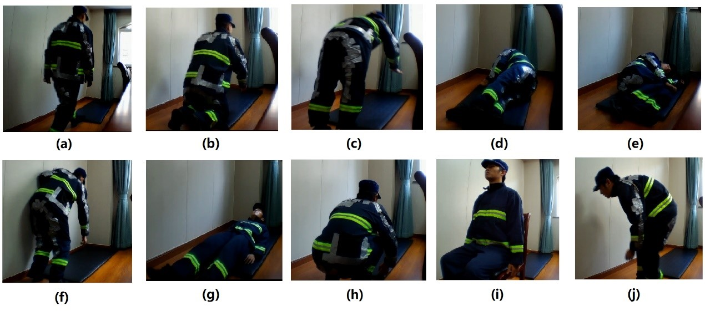

# Fall Detection System for Firefighters

## Abstract
During the past decade, falling has been one of the top three causes of death among firefighters in China. Even though there are many studies on fall-detection systems (FDSs), the majority use a single motion sensor. Furthermore, few existing studies have considered the impact sensor placement and positioning have on fall-detection performance; most are targeted toward fall detection of the elderly. This study proposed a smart wearable FDS for firefighter fall detection by integrating motion sensors into the firefighter's personal protective clothing on the chest, elbows, wrists, thighs, and ankles. The firefighter's fall activities are detected by the proposed multisensory recurrent neural network, and the performances of different combinations of inertial measurement units (IMUs) on different body parts were also investigated. The results highlighted the significance of the multi-IMU FDS. 

**More Details of our works**: https://www.mdpi.com/1424-8220/21/20/6770

## Dataset
This study initiated a collaboration with firefighters from the Haishu District Fire Brigade from Ningbo City, Zhejiang Province, China, to obtain realistic fall events by firefighters, based on their experiences. Fourteen male firefighters (with one to three years of firefighting experience, ages between 21 and 24 years old, with heights between 1.7 and 1.88 m) voluntarily participated in the data collection. Six of them were career firefighters and the other eight were volunteer firefighters. 

Six types of fall activities were collected, including a forward fall with the knees, a forward fall with hands, left and right sides of inclined falls, a backward fall, and a slow forward fall with a crouch. Three other activities, including crouching, sitting, and walking with a stoop, were also collected as fall-like activities. Each firefighter was requested to put on the developed PJ and PT and simulate falls and fall-like activities, based on their firefighting experience. The details of the falls and fall-like activities are illustrated below, including (a) walking to a mat before falling, (b) forward fall with the knees, (c) forward fall with the hands, (d) left side of an inclined fall, (e) right side of an inclined fall, (f) slow forward fall with a crouch first, (g) backward fall, (h) fall-like crouching, (i) fall-like sitting, and (j) fall-like walking with a stoop.


The number of trials for each activity and total trials are summarized in the following table.

|Code|Type|Activity|Trials|
|----|----|--------|------|
|F1 | Falls | forward falls using knees | 70 |
|F2 | | forward falls using hands | 70 |
|F3 | | inclined falls left | 56 |
|F4 | | inclined falls right | 56 |
|F5 | | slow forward falls with crouch first | 42 |
|F6 | | backward falls | 42 |
|FL1 | Fall-like | crouch | 56 |
|FL2 | | walk with stoop | 56 |
|FL3 | | sit | 42 |

**See dataset structure [here](fall_dataset/README.md)**

## Cite
If you use the dataset in your own work, please cite our paper.
```
  @Article{s21206770,
  AUTHOR = {Chai, Xiaoqing and Wu, Renjie and Pike, Matthew and Jin, Hangchao and Chung, Wan-Young and Lee, Boon-Giin},
  TITLE = {Smart Wearables with Sensor Fusion for Fall Detection in Firefighting},
  JOURNAL = {Sensors},
  VOLUME = {21},
  YEAR = {2021},
  NUMBER = {20},
  ARTICLE-NUMBER = {6770},
  PubMedID = {34695983},
  ISSN = {1424-8220},
  DOI = {10.3390/s21206770}
  }
```
